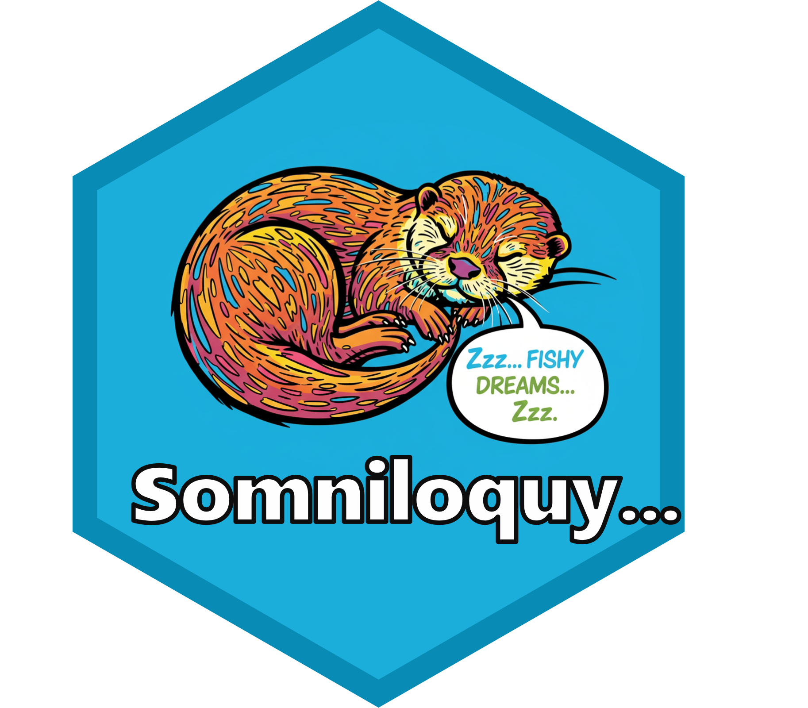

<!-- README.md is generated from README.Rmd. Please edit that file -->

# somniloquy 

<!-- badges: start -->

<!-- badges: end -->

This package is a personal collection of miscellaneous R functions that
were developed during several study groups and personal projects. The
package serves as a personal toolkit and a record of learning
experiences.

## Installation

You can install the development version of somniloquy from
[GitHub](https://github.com/) with:

``` r
# install.packages("pak")
pak::pak("ryo-asashi/somniloquy")
```
